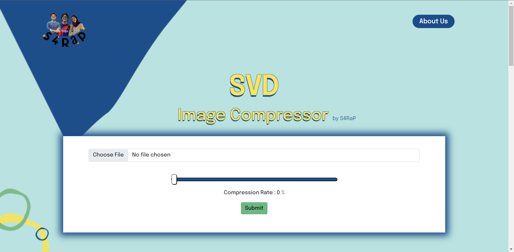
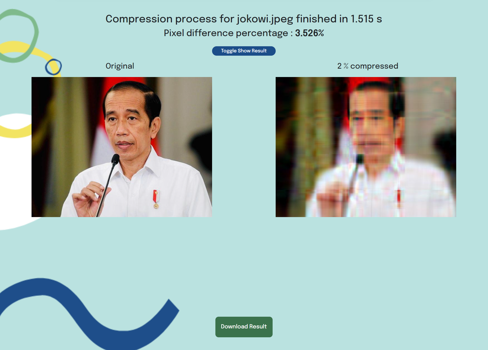
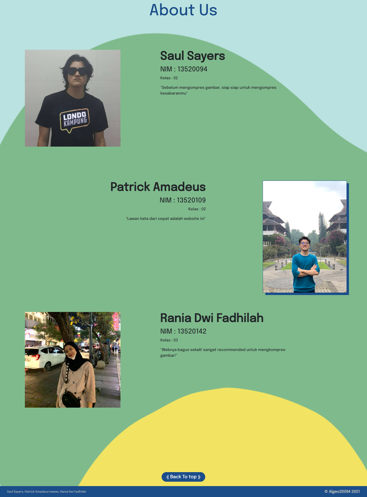

# Algeo02-20094
> Halo! Selamat datang di repository website *image compressor* S4RaP !!

*Website image compressor* ini dibuat oleh kelompok 32 yang beranggotakan :
- Saul Sayers (13520094)
- Patrick Amadeus Irawan (13520109)
- Rania Dwi Fadhilah (13520142)

Repository berisi website ini dibuat untuk memenuhi **Tugas Besar Mata Kuliah IF2123 Aljabar Linier dan Geometri** yang ke-2 pada Semester I Tahun Akademik 2021/2022. Silahkan dicoba! Jangan lupa untuk bersabar yaa..

## Table of Contents
* [Overview](#overview)
* [Programming Language](#programming-language)
* [Framework](#framework)
* [File Directory](#file-directory)
* [Screenshots](#screenshots)
* [Setup](#setup)
* [Usage](#usage)


## Overview
*Website* ini berfungsi untuk mengkompres suatu gambar.

Input yang diterima oleh *website* antara lain adalah :
- File gambar
- *Compression rate*

Sedangkan, output yang diberikan oleh *website* adalah :
- Gambar sebelum dikompres
- Gambar setelah dikompres (bisa di-*download*)
- Waktu pemrosesan
- *Image pixel difference percentage*


## Programming Language
- [Python](https://www.python.org/downloads/)
- Java Script
- CSS
- HTML

## Framework
Untuk membuat *front end* dan *back end website* ini, kami menggunakan *framework* Flask.\
Oleh karena itu, apabila ingin menggunakan *website* ini, jangan lupa untuk mengunduh Flask terlebih dahulu.

## File Directory
```
Algeo02-20094/ 
├─ src/ 
│  ├─ compress/ 
│  │  ├─ compress.py 
│  │  ├─ compresssvdver2.py 
│  ├─ static/ 
│  │  ├─ assets/ 
│  │  │  ├─ 3ver4.svg 
│  │  │  ├─ logoSARAP.png 
│  │  │  ├─ index.css 
│  │  │  ├─ patrick.jpg 
│  │  │  ├─ rania.jpg 
│  │  │  ├─ saul.jpg 
│  │  ├─ FileSaver.js 
│  │  ├─ index.js 
│  ├─ templates/ 
│  │  ├─ index.html 
│  ├─ app.py 
├─ doc/ 
│  ├─ Laporan Tugas Besar 2 Algeo Kelompok 32 
│  ├─ aboutus.png 
│  ├─ home.png
│  ├─ results.png 
├─ test/ 
│  ├─ birds.png
│  ├─ jokowi.jpeg
│  ├─ ngupil.png
│  ├─ temp.png
│  ├─ tigers.jpg
│  ├─ transparan.png 
├─ README.md 
```

## Screenshots





## Setup
Prerequisites : pip sudah terinstall pada komputer anda
### Instalasi Numpy

Pada terminal, jalankan command berikut
```
pip install numpy
```
### Instalasi PIL
Pada terminal, jalankan command berikut
```
pip install pillow
```

## Usage
Tanpa banyak basa-basi, yuk coba pake *website* buatan kita!

1. Clone repository kami dengan mengetikkan command berikan pada directory yang Anda inginkan

    ```
    git clone https://github.com/patrickamadeus/Algeo02-20094.git
    ```
2. Buka repository yang telah di-clone pada `cmd` / IDE kesayangan Anda, kemudian masuk ke dalam folder `src` dengan command berikut
    ```
    cd src
    ```
    Contoh tampilan :
    ```
    PS C:\Users\HP\Desktop\Algeo02-20094> cd src
    PS C:\Users\HP\Desktop\Algeo02-20094\src> 
    ```

3. Setelah masuk ke folder `src` Anda dapat menjalankan Flask App dengan mengetikkan command berikut
    ```
    python app.py
    ```
    Contoh tampilan  :
    ```
    PS C:\Users\HP\Desktop\Algeo02-20094\src> python app.py
    * Serving Flask app 'app' (lazy loading)
    * Environment: production
    WARNING: This is a development server. Do not use it in a production deployment.
    Use a production WSGI server instead.
    * Debug mode: on
    * Restarting with stat
    * Debugger is active!
    * Debugger PIN: XXX-XXX-XXX
    * Running on [ADDRESS] (Press CTRL+C to quit)
    ```

Kemudian, akan muncul sebuah link pada bagian `[ADDRESS]` dan kamu tinggal menekan `ctrl` sambil mengarahkan kursor ke link tersebut dan **VOILA!!**, web akan terbuka dan siap untuk digunakan!
